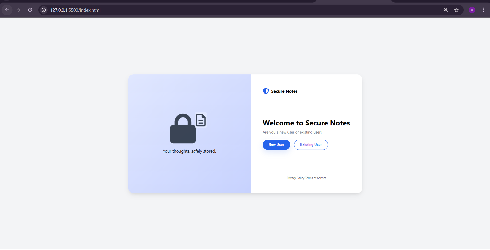
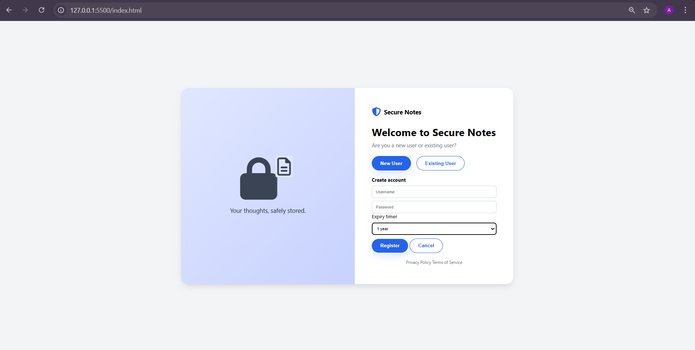
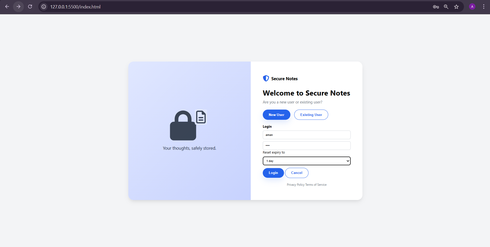
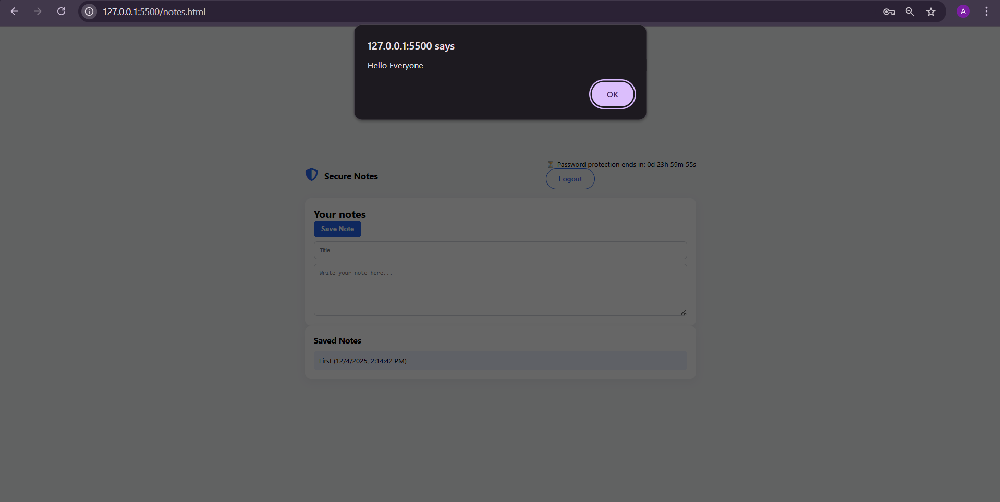
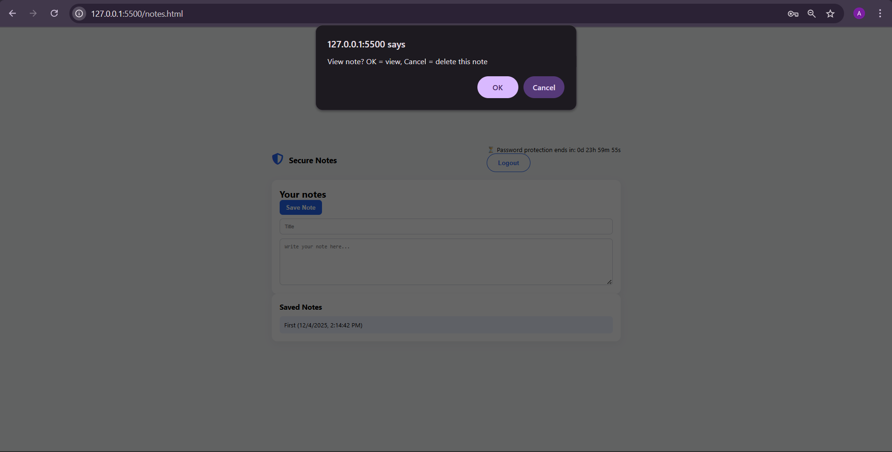
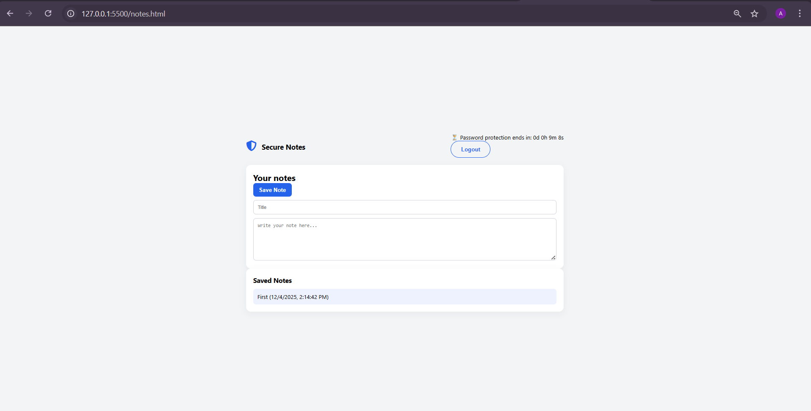

# Secure Notes — Time-Bound Encrypted Note App

Secure Notes is a lightweight web application that allows users to securely store, manage, and access personal notes — even after a login session expires. New users can register with a username, password, and a custom session duration. Returning users log in, optionally reset the session timer, and access their notes. Once the timer expires, notes remain accessible without requiring a password, offering convenience while keeping earlier sessions protected.

Users can create notes with a title (defaults to “Untitled” if empty) and content. Each note is timestamped and listed in a simple dashboard. Notes can be opened and viewed by clicking the title, and optional deletion is protected by a confirmation prompt. The application is designed for simplicity, privacy, and ease of use — suitable for quick note-taking with optional security.

---

## 📸 Screenshots & Pages

### 🏠 Home Page  
  
_Landing page introducing the Secure Notes application._

### 📝 Register Page  
  
_User registration form to create a new account._

### 🔐 Login Page  
  
_User login form with session duration selection._

### 📩 Message/Notification Screen  
  
_Informational page showing login/registration or status messages._

### 🗂️ Notes List Page  
  
_List of all saved notes — click a title to view a note._

### 💾 Save Note Page  
  
_Form for creating or saving a new note with title and content._

